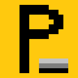
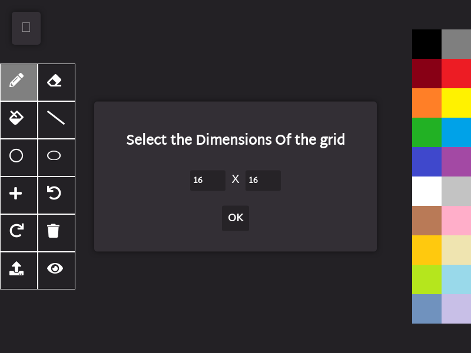
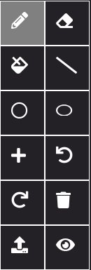

# PixelCraft  
A pixel art & animation creation tool built using HTML5 Canvas.  
It is a **Progressive Web App (PWA)** with offline compatibility, mobile-friendly design, and an intuitive interface.  

  

## Features  
- **Customizable Canvas**: Choose dimensions (default: 16x16). Dimensions below 128x128 are recommended for smooth performance.  
- **GIF Support**: Create animations by adding frames and exporting them as GIFs.  
- **Offline Support**: Works seamlessly as a PWA.  
- **Advanced Tools**: Import images, convert them to pixel art, and customize them easily.  
- **Flexible Output**: Save your creations as PNG or GIF.  
- **Color Transparency**: Create complex patterns using translucent colors.  

---

## Table of Contents  
1. [Overview](#overview)  
2. [Toolbar](#toolbar)  
3. [GIF Tools](#gif-tools)  
4. [Utility Tools](#utility-tools)  
5. [Advanced Tools](#advanced-tools)  
6. [Saving Pixel Art and GIF Animation](#saving-pixel-art-and-gif-animation)  
7. [Color Palette & Transparency](#color-palette--transparency)  
8. [PWA Support](#pwa-support)  
9. [Sample Pixel Art](#sample-pixel-art)  
10. [Contact Information](#contact-information)  

---

## Overview  

On opening PixelCraft, you’ll see a screen like this:  

  

You can select canvas dimensions. The default is **16x16**, but dimensions below **128x128** are preferable for smooth operation and GIF creation.  

---

## Toolbar  

  

PixelCraft includes the following tools:  

### 1. Pencil  
Draw pixels freehand.  

  

### 2. Eraser  
Erase pixels one at a time. The size is fixed at **1x1**.  

  

### 3. Paint Tool  
Flood-fill a region with a new color.  

  

### 4. Line Tool  
Draw a line segment between two points using the **Bresenham line-drawing algorithm**.  

  

### 5. Circle Tool  
Draw a circle using the **Midpoint Circle Algorithm**.  

  

### 6. Ellipse Tool  
Draw an ellipse by specifying the center and radii along the x-axis and y-axis.  

  

---

## GIF Tools  

### Add Frame  
Add the current canvas state to the frame stack.  

### View Frame  
Displays a popup with all frames in the stack. Click to load, right-click to delete a frame.  

  

---

## Utility Tools  

### Undo/Redo  
Undo or redo small pixel changes (one pixel at a time).  

### Clear Window  
Clear the entire canvas.  

---

## Advanced Tools  

### Import Image  
Convert an image into pixel art at customizable dimensions.  

  

---

## Saving Pixel Art and GIF Animation  

### Save Image  
Download your artwork as a PNG with dimensions scaled to **10x width x 10x height**.  

### Save GIF  
Export your animations as GIFs.  

---

## Color Palette & Transparency  

Choose colors from a pre-defined palette. Set transparency values (between 0 and 1) for creating complex patterns.  

  

---

## PWA Support  

Install PixelCraft as a PWA via the dropdown menu or “Add to Home Screen” on mobile devices.  

  

---

## Sample Pixel Art  

Here are some creations made using PixelCraft:  

  
  

---

## Contact Information  

Feel free to reach out for support, contributions, or feedback:  

- **Email**: [k.aaditya.gupta@gmail.com](mailto:k.aaditya.gupta@gmail.com)  
- **GitHub**: [AadityaKGupta](https://github.com/AadityaKGupta)  
